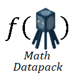

# Math-Minecraft-Squid-Workshop-Project
Minecraft math helper by Mingshi Yang - Squid Workshop. \
Minecraft *Java Edition 1.13+* is supported, you may consult [here](https://minecraft.fandom.com/wiki/Data_pack#Pack_format) and set the [pack.mcmeta](Math-Datapack-Squid-Workshop/pack.mcmeta) file according to your game version.

# Introduction
This datapack provide fast, high precision math operation functions using Scoreboard.
- **Constants** are stored under objective **swMath_C**. Feel free to define more in [this file](Math-Datapack-Squid-Workshop/data/math/functions/classes/main/load.mcfunction).
- **Variables**, including inputs and outputs, are stored under objective **swMath_V**.
- For high precision computation, the input and output may have *units* of **0.0001**. i.e., the score **10000** is used to represent **1**, utilizing 4 digits. Actual error in computation is usually on magnitude of 0.01%. One visualization of different magnitudes of error is [here](Gallery/Images/block_displacement.png). See [example](#Example) for implementation detail.
- **_No entities_** involved in calculations, avoiding entity selection ensures high throughout performance, compatibility and easy maintenance.

# Installation
- Step 01 Download this repository as a zip and unpack.
- Step 02 Go to Minecraft directory, usually "C:/Users/youUserName/AppData/Roaming/.minecraft".
- Step 03 Choose the world folder in which you want to install the pack. Go to .../saves/world/datapacks folder.
- Step 04 Open Minecraft and open the world.
- Step 05 Type "/reload" command then press enter.
- Step 06 Enjoy

# How to use

## List of functions
The main function directory is math:functions/classes/core/. All functions provided are listed below. \
To execute a function, consult the table and run the command

        /function math:classes/core/Function
### Functions that require 0 input
| 
Function
 | 
Description
 | 
Unit
 |
| ----- | ----- | ----- |
| random/randint_base | return an integer following uniform distribution: Min = -2^31, Max = 2^31-1 | N/A |
| random/randint_t | return an integer following t distribution, N >= 30 ~ Z distribution N_Sample = **#vIn**, Mean = 0, SD = 10000 | N/A |
| util/swap | a shortcut to assign value of input **#vIn** using value of output **#vOut** | N/A |

### Functions that require 1 scalar input **#vIn**
| 
Function
 | 
Description
 | 
Unit
 |
| ----- | ----- | ----- |
| operations/square | compute square (1) (2) | N/A |
| operations/sqrt | compute square root (2) | N/A |
| trig/arccos_rad | compute inverse cosine (3) | 0.0001 |
| trig/arcsin_rad | compute inverse sine | 0.0001 |
| trig/arctan_rad | compute inverse tangent | 0.0001 |
| trig/cos_rad | compute cosine | 0.0001 |
| trig/sin_rad | compute sine | 0.0001 |
| trig/tan_rad | compute tangent | 0.0001 |
| util/deg2rad | convert from degrees to radians | 0.0001 |
| util/rad2deg | convert from radians to degrees | 0.0001 |

### Functions that require 2 scalar inputs **#vIn, #vIn2**
| 
Function
 | 
Description
 | 
Unit
 |
| ----- | ----- | ----- |
| operations/division_4d | compute #vIn2 / #vIn with high precision | 0.0001 |
| operations/division_round | compute #vIn2 / #vIn with rounding of output integer | N/A |
| operations/multiply | compute #vIn * #vIn2 (1) | N/A |
| trig/arctan2_rad | compute inverse tangent of  #vIn2 / #vIn  choosing the quadrant correctly | 0.0001 |

### Functions that require 1 3D vector inputs **#vAi, #vAj, #vAk**
| 
Function
 | 
Description
 | 
Unit
 |
| ----- | ----- | ----- |
| vector/magnitude | compute magnitude of vector | 0.0001 |
| vector/unit | compute unit vector | 0.0001 |

### Functions that require 2 3D vector inputs **#vAi, #vAj, #vAk; #vBi, #vBj, #vBk**
| 
Function
 | 
Description
 | 
Unit
 |
| ----- | ----- | ----- |
| vector/cross (4) | compute cross product | N/A |
| vector/dot (4) | compute dot product | N/A |

### The output values are one set from the following
| 
Scalar
 | 
Vector
 |
| ----- | ----- |
| **#vOut**, **#vOut_Mag** if needed | **#vOi, #vOj, #vOk** |

## Example
### Steps to compute 123456 / 31416 (direct scoreboard operation returns 3):
- Set input

        /scoreboard players set #vIn2 swMath_V 123456
        /scoreboard players set #vIn swMath_V 31416
- Run function

        /function math:classes/core/operations/division_4d
- Get output

        /scoreboard players get #vOut swMath_V
        _The above outputs 39297 units which matches the exact value 3.929717341._

### Steps to compute cosine of 0.5 radians:
- Set input, 0.5 radians is 5000 units

        /scoreboard players set #vIn swMath_V 5000
- Run function

        /function math:classes/core/trig/cos_rad
- Get output

        /scoreboard players get #vOut swMath_V
        _The above outputs 8776 units which matches the exact value 0.8775825619._

### Note
(1) Since the result may overflow the scoreboard, the magnitude is stored separately as **#vOut_Mag** and the **#vOut** may be scaled down to fit in the scoreboard. i.e. result = #vOut * #vOut_Mag

(2) In these operations, the input is considered _without_ units.

(3) All trigonometry operations use radians as unit of measurement.

(4) Overflow is not yet monitored and result is not yet scaled.

# Projects powered by Math Datapack
[Pool Datapack](https://github.com/MingshiYangUIUC/Pool-Minecraft-Squid-Workshop-Project)  \
[Soccer Datapack](https://github.com/MingshiYangUIUC/Soccer-Minecraft-Squid-Workshop-Project)

# Terms of Use

**NO COMMERCIAL USE.** 

## License
[Mozilla Public License 2.0](https://github.com/MingshiYangUIUC/Autoaim-Minecraft-Squid-Workshop-Project/blob/main/LICENSE)

# More About Squid Workshop
More datapacks developed by us [here](https://github.com/Squid-Workshop/MinecraftDatapacksProject) \
Watch our videos on youtube [here](https://www.youtube.com/channel/UCwPMgfjjh2d7fFqQ1PXHP7w) \
Watch our videos on bilibili [here](https://space.bilibili.com/649645265?from=search&seid=778816111336987286) \
Join our QQ group: 74681732 \
Subscribe on wechat: 鱿鱼MC工作室 
